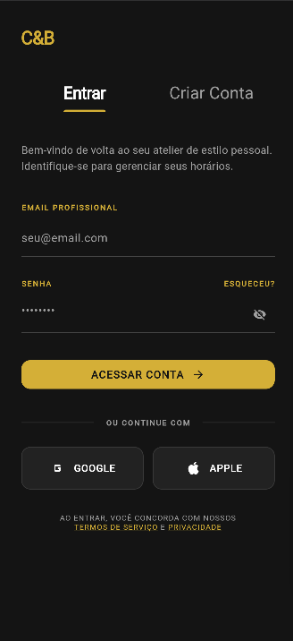
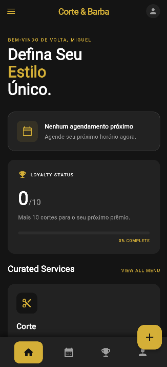
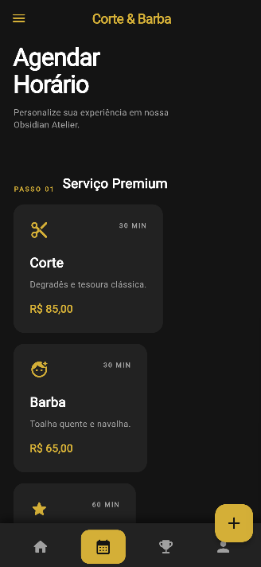
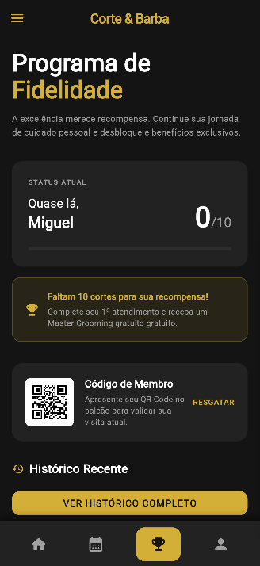
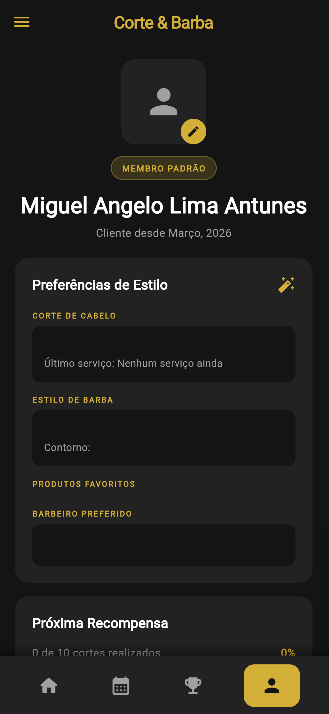

<h1 align="center">✂️ Corte & Barba</h1>

<p align="center">
  Aplicativo mobile de barbearia com agendamento, programa de fidelidade e perfil do cliente — construído com Flutter e Firebase.
</p>

<p align="center">
  
  
  
  
</p>

---

## 📱 Telas

<table>
  <tr>
    <td align="center">
      <br/>
      <sub><b>Login / Cadastro</b></sub>
    </td>
    <td align="center">
      <br/>
      <sub><b>Home</b></sub>
    </td>
    <td align="center">
      <br/>
      <sub><b>Agendamento</b></sub>
    </td>
    <td align="center">
      <br/>
      <sub><b>Fidelidade</b></sub>
    </td>
    <td align="center">
      <br/>
      <sub><b>Perfil</b></sub>
    </td>
  </tr>
</table>

---

## ✨ Funcionalidades

- **Autenticação** — Login e cadastro com e-mail/senha via Firebase Auth, redirecionamento automático com GoRouter
- **Agendamento** — Seleção de serviço, barbeiro e horário com confirmação em tempo real no Firestore
- **Programa de Fidelidade** — Contagem de cortes, barra de progresso, QR code de membro e histórico de visitas
- **Perfil** — Foto, preferências de estilo, dados pessoais e configurações
- **Internacionalização** — Suporte completo a PT-BR, EN e ES
- **Design System** — Atomic design com atoms, molecules e organisms reutilizáveis

---

## 🏗️ Arquitetura

```
lib/
├── core/
│   ├── presentation/widgets/
│   │   ├── atoms/          # AppCard, AppTextField, SheetHandle, GoldProgressBar...
│   │   ├── molecules/      # BarberCard, ServiceCard, SettingsMenuItem...
│   │   └── organisms/      # BrandAppBar
│   ├── locale/             # AppLocalizations (PT-BR, EN, ES)
│   ├── router/             # GoRouter + auth redirect
│   └── theme/              # AppColors
│
├── features/
│   ├── auth/               # Firebase Auth — Cubit + AuthState
│   ├── scheduling/         # BookingBloc + BookingFormCubit + Firestore datasource
│   ├── loyalty/            # LoyaltyCubit + Firestore query
│   ├── profile/            # ProfileCubit + Firebase Auth write
│   ├── home/               # HomePage + ShellPage (bottom nav + drawer)
│   ├── catalog/            # Serviços disponíveis
│   └── barber/             # Barbeiros disponíveis
│
└── injection_container.dart  # GetIt DI
```

**Padrão:** Clean Architecture — Domain / Data / Presentation por feature  
**Estado:** BLoC + Cubit  
**Navegação:** GoRouter com ShellRoute e refresh automático por auth stream

---

## 🚀 Como rodar

### Pré-requisitos

- Flutter SDK `>= 3.0`
- Conta no [Firebase Console](https://console.firebase.google.com)
- [FlutterFire CLI](https://firebase.flutter.dev/docs/cli)

### 1. Clone o repositório

```bash
git clone https://github.com/Miguel12342342/barbearia_app.git
cd barbearia_app
```

### 2. Instale as dependências

```bash
flutter pub get
```

### 3. Configure o Firebase

Crie seu projeto no Firebase Console e rode:

```bash
dart pub global activate flutterfire_cli
flutterfire configure
```

Isso vai gerar `lib/firebase_options.dart` automaticamente.  
Ative **Authentication → E-mail/Senha** e **Firestore Database** no console.

### 4. Rode o app

```bash
flutter run
```

---

## 🔒 Segurança

Os arquivos `firebase_options.dart` e `google-services.json` estão no `.gitignore` e nunca são commitados.  
Configure as Firestore Security Rules no console:

```js
rules_version = '2';
service cloud.firestore {
  match /databases/{database}/documents {
    match /appointments/{appointmentId} {
      allow read, write: if request.auth != null
                         && request.auth.uid == resource.data.userId;
      allow create: if request.auth != null
                    && request.auth.uid == request.resource.data.userId;
    }
  }
}
```

---

## 🛠️ Stack

| Camada | Tecnologia |
|---|---|
| UI | Flutter 3 |
| Estado | flutter_bloc (BLoC + Cubit) |
| Navegação | go_router |
| Backend | Firebase Auth + Cloud Firestore |
| DI | get_it |
| Internacionalização | Manual delegate (PT-BR, EN, ES) |
| QR Code | qr_flutter |

---

## 📸 Como adicionar as screenshots

1. Rode o app: `flutter run`
2. Tire prints das telas no emulador ou device
3. Salve em `docs/screenshots/` com os nomes exatos:
   - `login.png`
   - `home.png`
   - `booking.png`
   - `loyalty.png`
   - `profile.png`
4. Commit e push — as imagens aparecem automaticamente no README

---

<p align="center">Feito por Miguel Angelo🌹</p>
